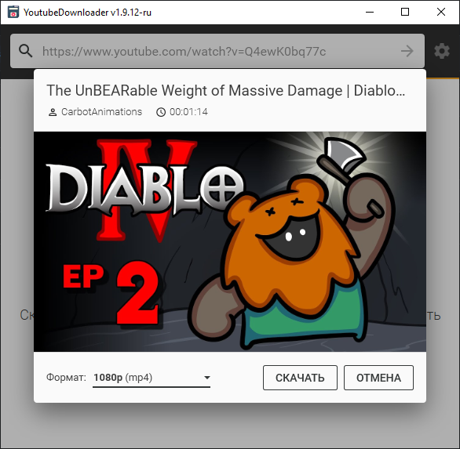
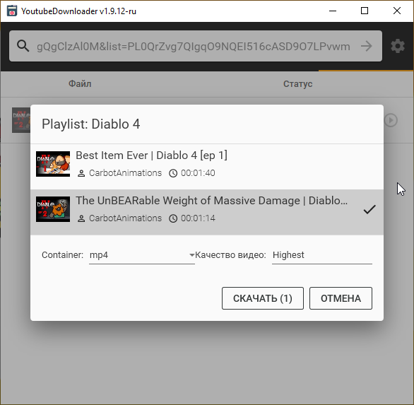

# YoutubeDownloaderRU

**YoutubeDownloaderRU** это приложение, которое позволяет загружать видео с YouTube.
Вы можете скопировать и вставить URL-адрес любого видео, плейлиста или канала и загрузить его непосредственно в выбранный вами формат.
Он также поддерживает поиск по ключевым словам, что полезно, если вы хотите быстро найти и загрузить видео.

## Скачать

- 🟢 **[Stable release](https://github.com/DormirProf/YoutubeDownloader/releases/tag/latest)**

## Отличия от основного репозитория
- **Работает в России**
- Переведено на русский язык
- Для корректной работы приложения удалены авто-обновновления

## Особенности
- Загружать видео по URL-адресу
- Загружайте видео из списков воспроизведения или каналов
- Загрузка видео по поисковому запросу
- Выбираемое качество и формат видео
- Автоматическое встраивание субтитров
- Автоматическое добавление медиа-тегов

## Скриншоты

